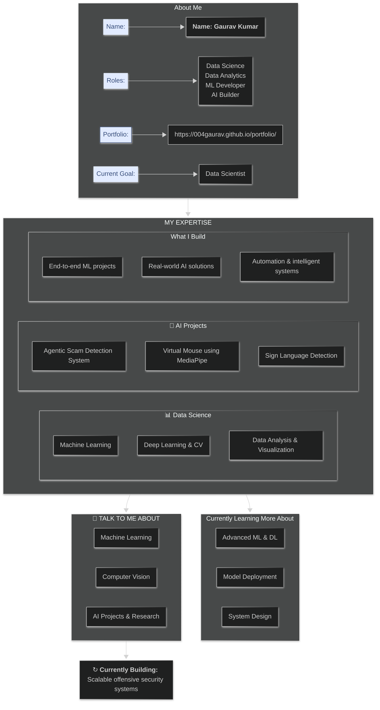
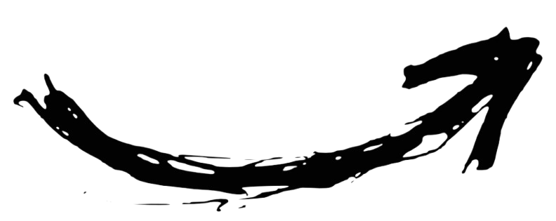

  <h5>

  </h5>

  

        <pre><h3>Click Box For More About Me :p </h3></pre>
  

---

**Data Science Enthusiast** • **ML Engineer** • **AI Builder**

Visit: [004Gaurav.com](https://004gaurav.github.io/portfolio/)

    
  
  
  
  
  
      

  <table border="1">
    <tr>
      <td align="center"><kbd>👨‍💻 Data Scientist</kbd></td>
      <td align="center"><kbd>🤖 Machine Learning</kbd></td>
      <td align="center"><kbd>👁️ Computer Vision</kbd></td>
      <td align="center"><kbd>🚀 AI Projects</kbd></td>
    </tr>
  </table>

 

 

<h3 align="center"><code>Mostly Work With:</code></h3>

  
  
  
  
  
  

---

<h3>Connect Via 
   
   
  

  
  &nbsp;&nbsp;&nbsp;
  
  &nbsp;&nbsp;&nbsp;
  

</h3> 
 

